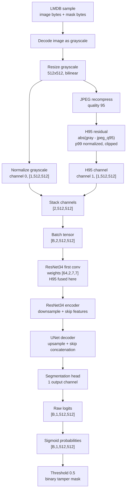
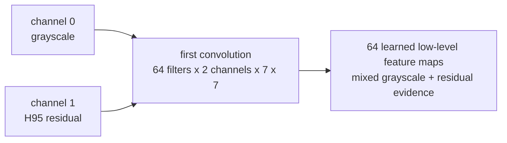

# ResNet34-UNet H95 Architecture Explanation

This note explains the model driven by `notebooks/train_resnet34_h95_a100_colab.ipynb`.

The notebook is an orchestration notebook. It mounts Drive, writes an A100-tuned copy of `configs/resnet_h95_config.yaml`, then calls the project pipeline in `src/`. The actual model is created in `src/models.py` from the config.

## Short Answer

The model incorporates H95 as the second input channel. The input tensor is:

```text
[B, 2, 512, 512]
 channel 0 = grayscale image normalized to [0, 1]
 channel 1 = H95 / JPEG-Q95 residual heatmap normalized to [0, 1]
```

The ResNet34 first convolution is changed from the normal RGB shape `[64, 3, 7, 7]` to `[64, 2, 7, 7]`. That means grayscale and H95 are fused immediately in the first convolution, not in a separate branch and not late in the decoder.

The output tensor is:

```text
[B, 1, 512, 512]
 one raw logit per pixel
```

At inference/evaluation, logits are passed through `sigmoid` to produce tamper probabilities, then thresholded at `0.5` for the official binary tamper mask.

## Source Anchors

- Notebook: `notebooks/train_resnet34_h95_a100_colab.ipynb`
- Config: `configs/resnet_h95_config.yaml`
- Preprocessing: `src/preprocessing.py`
- Dataset assembly: `src/datasets.py`
- Model creation: `src/models.py`
- Training contract and batching: `src/train.py`
- Evaluation output conversion: `src/evaluate.py`
- Existing summary: `res/model_summary.txt`

## Configured Model

From `configs/resnet_h95_config.yaml`:

```yaml
preprocessing:
  image_size: 512
  jpeg_quality: 95

model:
  name: resnet34_unet
  encoder_name: resnet34
  encoder_weights: imagenet
  input_mode: gray_h95
  in_channels: 2
  classes: 1
  activation: null
```

The project creates the model as:

```python
smp.Unet(
    encoder_name="resnet34",
    encoder_weights="imagenet",
    in_channels=2,
    classes=1,
    activation=None,
)
```

The local model summary confirms:

```text
model name: ResNet34-H95 UNet
method: grayscale + H95
input mode: gray_h95
input channels: 2
output classes: 1
first convolution weight shape: [64, 2, 7, 7]
first conv has exactly 2 input channels: yes
```

## Input Construction

For every DocTamper sample, the dataset returns a dictionary containing `input`, `mask`, `gray`, and `h95`.

Preprocessing does this:

1. Decode the image and convert it to grayscale.
2. Resize grayscale to `512x512` with bilinear interpolation.
3. Recompress the resized grayscale image as JPEG at quality `95`.
4. Compute the absolute residual:

```text
diff = abs(resized_gray - jpeg_q95_gray)
```

5. Normalize the residual with the 99th percentile and clip to `[0, 1]`:

```text
h95 = clip(diff / (percentile_99(diff) + 1e-8), 0, 1)
```

6. Normalize grayscale to `[0, 1]`.
7. Resize the mask to `512x512` with nearest-neighbor interpolation and binarize it.
8. Stack grayscale and H95:

```text
input = stack([gray, h95], axis=0).astype(float32)
mask  = binary_mask[None, :, :].astype(float32)
```

So one sample has:

```text
input: [2, 512, 512]
mask:  [1, 512, 512]
gray:  [512, 512]
h95:   [512, 512]
```

Training batches stack samples into:

```text
x: [B, 2, 512, 512]
y: [B, 1, 512, 512]
```

The notebook/training contract dry-runs:

```text
input  = [2, 2, 512, 512]
logits = [2, 1, 512, 512]
```

## Visualization



## H95 Fusion Point



Mathematically, each first-layer output feature map is learned from both channels:

```text
feature_k = conv2d(gray, W[k, gray, :, :]) + conv2d(h95, W[k, h95, :, :])
```

So H95 is not treated as metadata. It is pixel-aligned image evidence that the first layer can weight, amplify, suppress, or combine with grayscale texture.

## Encoder-Decoder Shape View

Approximate shape flow for the configured `512x512` input:

| Stage | Shape | Meaning |
|---|---:|---|
| Dataset sample | `[2, 512, 512]` | grayscale + H95 |
| Training batch | `[B, 2, 512, 512]` | BCHW model input |
| ResNet34 conv1 | `[B, 64, 256, 256]` | first learned fusion of grayscale and H95 |
| ResNet34 layer1 area | `[B, 64, 128, 128]` | low-level skip features |
| ResNet34 layer2 | `[B, 128, 64, 64]` | mid-level features |
| ResNet34 layer3 | `[B, 256, 32, 32]` | deeper semantic features |
| ResNet34 layer4 | `[B, 512, 16, 16]` | bottleneck features |
| UNet decoder | progressively back to `512x512` | upsample + skip connections |
| Segmentation head | `[B, 1, 512, 512]` | one tamper logit per pixel |
| Sigmoid | `[B, 1, 512, 512]` | tamper probability per pixel |
| Threshold | `[B, 1, 512, 512]` | binary tamper prediction |

`channels_last` in the notebook/config is a CUDA memory-layout optimization. The semantic model contract is still BCHW: `[batch, channels, height, width]`.

## Output Meaning

The model has `classes: 1` and `activation: null`, so it returns raw logits:

```text
logits[b, 0, y, x]
```

Higher logits mean stronger evidence that pixel `(x, y)` belongs to the tampered region. Evaluation converts logits into probabilities:

```text
prob = sigmoid(logit)
```

The official prediction mode is:

```text
predicted_tamper_pixel = prob >= 0.5
```

The training loss is a BCE-with-logits plus Dice loss combination, so the model is optimized both for per-pixel classification and mask overlap.

## What H95 Adds

H95 is a JPEG recompression residual. It highlights places where the image behaves differently after quality-95 JPEG recompression. In document tampering, manipulated regions can have compression or texture inconsistencies that are not obvious in grayscale intensity alone.

Because H95 is a spatial channel aligned with the grayscale image, the model can learn patterns such as:

- grayscale edge or text structure plus strong local H95 residual;
- weak grayscale contrast but unusual H95 response;
- H95 noise outside the mask that should be ignored;
- H95 response inside a tampered region that supports a positive mask prediction.

## What It Is Not

- It is not RGB input. The model uses grayscale plus H95, exactly two channels.
- It is not a separate H95 branch.
- It is not appended after the encoder.
- It is not a post-processing feature.
- It is not connected-component filtering. The recorded `no_blob` label means raw sigmoid output thresholded at `0.5`.

## Input-Output Summary

```text
Raw LMDB image + mask
  -> grayscale image
  -> resized grayscale [512,512]
  -> H95 residual [512,512]
  -> stacked tensor [2,512,512]
  -> batch [B,2,512,512]
  -> ResNet34-UNet
  -> logits [B,1,512,512]
  -> sigmoid probabilities
  -> thresholded binary tamper mask
```

In plain terms: H95 enters as channel 1 of the image tensor. The first ResNet34 convolution sees grayscale and H95 at the same time and learns how to combine them for pixel-level tamper segmentation.
